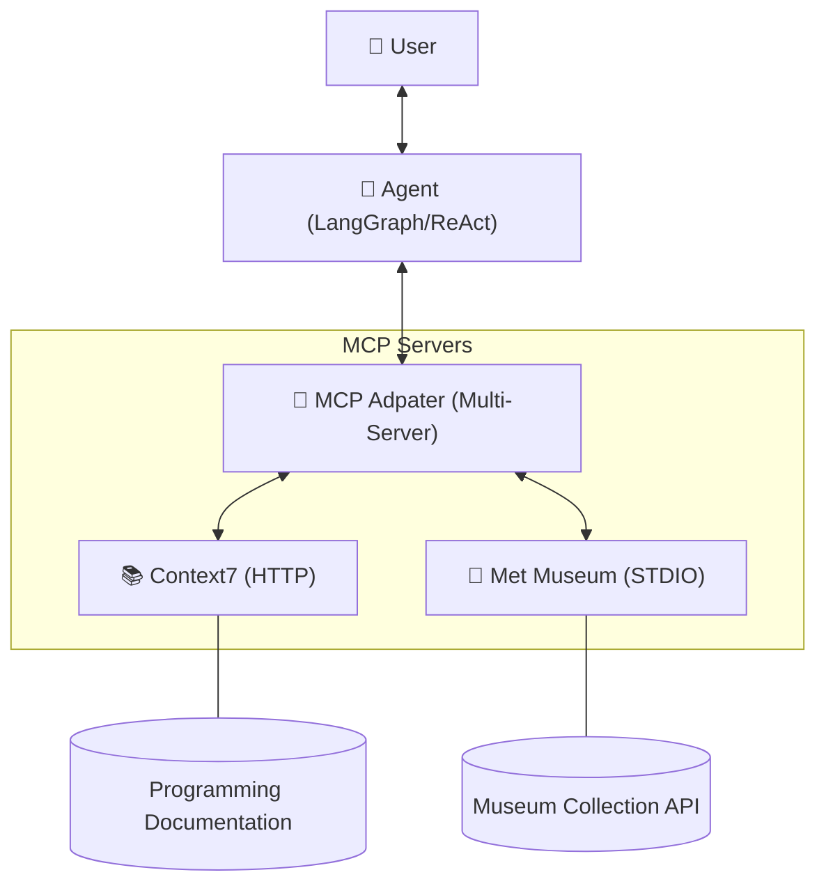

# MCP Multi-Server AI Agent 🤖

This project demonstrates how to build an **AI agent that connects to multiple Model Context Protocol (MCP) servers** and utilizes them as tools.

The agent is built with a focus on modern AI architecture, leveraging:

- **LangGraph** for flexible, stateful agentic workflows.
- **LangChain MCP Adapters** for seamless tool integration.
- **OpenAI Models** (e.g., GPT-4o-mini).
- **Model Context Protocol (MCP)** for standardized tool/data access.

---

## 🏛 Architecture

The agent follows the **ReAct (Reason + Act)** pattern, allowing it to reason about a user's query and then dynamically select and execute tools across different MCP servers.



### 🛰 Connected Servers

1.  **Context7 MCP Server**:
    *   **Provides**: Real-time programming documentation and reference data.
    *   **Transport**: `streamable_http`.
    *   **Data Source**: High-quality remote documentation repositories.

2.  **Met Museum MCP Server**:
    *   **Provides**: Extensive access to the Metropolitan Museum of Art's physical and digital collections.
    *   **Transport**: `stdio` (via `npx`).
    *   **Capability**: Search and retrieve metadata about world-class artworks.

---

## 📁 Project Structure

```bash
mcp-agent-orchestrator/
├── main.py             # Core agent logic and CLI
├── .env.example        # Template for API keys
├── .gitignore          # Standard Python ignore rules
├── README.md           # Project documentation
└── requirements.txt    # Pinned dependency list
```

---

## 🚀 Getting Started

### 1. Prerequisites
- Python 3.10+
- Node.js & npm (required for the `npx` based MCP server)
- OpenAI API Key

### 2. Installation

Clone this repository and create a virtual environment:

```bash
python -m venv .venv
source .venv/bin/activate  # On Windows: .venv\Scripts\activate
```

Install dependencies:

```bash
pip install -r requirements.txt
```

### 3. Configuration

Rename `.env.example` to `.env` and add your OpenAI API key:

```bash
cp .env.example .env
# Edit .env with your credentials
```

### 4. Running the Application

Launch the command-line AI assistant:

```bash
python main.py
```

---

## ✨ Professional Features

- **Multi-Server Integration**: Demonstrates handling both HTTP and STDIO transport protocols simultaneously.
- **Stateful Memory**: Uses `InMemorySaver` to maintain context throughout the session.
- **Robust Error Handling**: Connected servers are validated on startup; errors are gracefully logged.
- **Environment Management**: Secure API key handling via `python-dotenv`.
- **Standard Logging**: Uses Python's `logging` module for production-like observability.

---

## 🎨 Example Interactions

Ask about programming:
> "Explain Python async functions." (Agent uses Context7)

Ask about history/art:
> "Show a famous painting from the Met Museum." (Agent uses Met Museum)

---

## 👨‍💻 Author

This project was developed as a case study for **Model Context Protocol (MCP)** integration in agentic AI systems.
